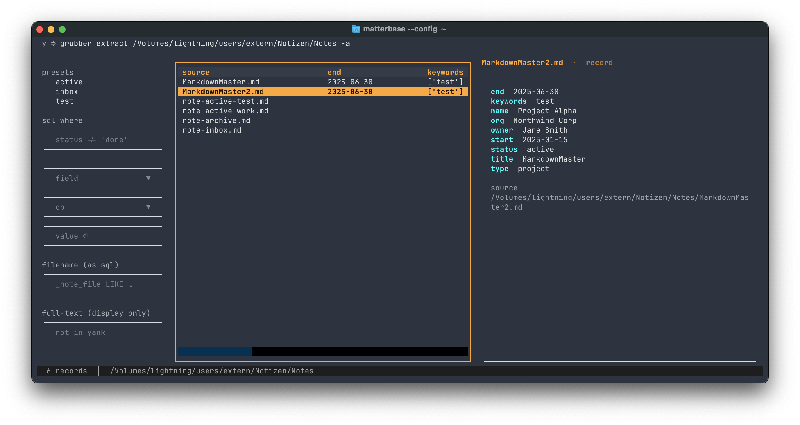

# matterbase

A database-like table view on frontmatter and YAML records in Markdown notes. Build a query command for the shell (field filters and SQL). For macOS and Linux.
grubber and matterbase are designed to keep data and context together.

## Why?

Markdown notes with frontmatter/YAML are a lightweight alternative to dedicated
databases, but querying them usually means writing custom scripts or learning
the syntax of a specialised tool.

matterbase puts a TUI in front of that. You build a query — preset filters,
a SQL WHERE clause, a filename search — and the matching records appear
immediately in one table, whatever file they came from. When you have what you
want, press `y` to copy the underlying shell pipeline — ready to pipe into
other tools.

A typical workflow: activate the `contacts` preset, add `birthday IS NOT NULL`
via the SQL form, and yank. The copied command pipes grubber through DuckDB,
so appending `| jq -r '.[] | .name + " " + .birthday'` gives you a clean list.

```
┌─ grubber … | duckdb 'SQL'  (y to copy) ──────────────────────────────┐
├────────────────┬────────────────────────────┬────────────────────────┤
│ query builder  │ the filtered records       │ adaptive preview       │
│  presets       │ (all sources, one table,   │ whole / compact /      │
│  sql where     │  source as a column)       │ record — global mode,  │
│  filename      │                            │ applied per type       │
│  full-text     │                            │                        │
└────────────────┴────────────────────────────┴────────────────────────┘
```


*The query builder on the left, every passing record in one table, and the
preview in `record` mode showing the selected record's fields.*

The unit is the **record**: a markdown file contributes one record
per YAML block (plus frontmatter), a jsonl file one per line. The source file
is a field on the record (`_note_file`). The source file is previewed in the
right pane and can be opened to edit the records or the context in the
source markdown file. See [ARCHITECTURE.md](ARCHITECTURE.md) for the technical layering.

Written in Go on [Bubble Tea](https://github.com/charmbracelet/bubbletea) —
a single static binary, instant startup. Uses
[grubber](https://github.com/rhsev/grubber) for record extraction and
filtering, [apex](https://github.com/ttscoff/apex) for preview rendering,
[bat](https://github.com/sharkdp/bat) for syntax highlighting, and the
[DuckDB](https://duckdb.org) CLI for SQL.

## Requirements

- [grubber](https://github.com/rhsev/grubber) **≥ 0.12.0** — install it and
  make sure it's on `PATH` (override the location with `$GRUBBER`). matterbase
  checks the version at startup. It scans the notes dir once per refresh into
  a JSONL cache and re-filters by replaying it through `grubber --from-jsonl`;
  0.12.0 is the release with `--merge-on` (collection index + annotation
  dedup). `grubber_set` needs ≥ 0.13.0 (`from_jsonl` in config sets).
- [duckdb](https://duckdb.org) CLI — for the SQL WHERE channel. The UI runs
  the same `duckdb` command the yank produces; without it, presets, filename
  and full-text still work.
- [apex](https://github.com/ttscoff/apex) (optional, for preview rendering)
- [bat](https://github.com/sharkdp/bat) (optional, for syntax-highlighted
  preview of typst and other text files)

## Installation

```
go install github.com/rhsev/matterbase/cmd/matterbase@latest
```

Or grab a binary from the [releases](https://github.com/rhsev/matterbase/releases)
page (macOS arm64/amd64, Linux amd64/arm64), `chmod +x`, put it on `PATH`.
macOS quarantines browser downloads: `xattr -d com.apple.quarantine matterbase-*`.

## Usage

```
matterbase --config path/to/config.yml [PATH]
```

## Config

```yaml
notes_dir: ~/Notes/Work        # directory of record sources
editor: hx                     # editor command
apex_theme: nord256            # apex theme name (optional)
apex_width: 80                 # apex --width value (optional)
apex_code_highlight: pygments  # apex --code-highlight tool (optional)
apex_code_highlight_theme: nord  # its theme (optional)
grubber_search_mode: all       # all | frontmatter | blocks_only  (default: all)
array_fields: [tags, keywords] # fields grubber normalises to arrays
table_columns: [status, project, type]    # column selection + order (omit = auto)
column_widths: {source: 30, status: 12}   # per-column widths (optional)
sql: "status != 'archive'"     # default SQL WHERE clause (optional)
grubber_set: notes             # yank via grubber config set (optional, see Yank)

presets:                       # the grubber query sets ("filters" also accepted)
  - label: "active"
    query:
      - "status=active"

  - label: "business"
    query:
      - "project=business"
      - "status=active"       # AND within one preset

  - label: "Q1-2026"
    query:
      - "start^2026-01"
```

### Filter operators (grubber syntax)

| Operator | Meaning      | Example          |
|----------|--------------|------------------|
| `=`      | equals       | `status=active`  |
| `~`      | contains     | `name~hosting`   |
| `^`      | starts with  | `end^2026`       |
| `!`      | not equals   | `status!archive` |

Multiple expressions within one preset are ANDed together. Activating multiple
presets ANDs them too — all expressions go into a single grubber call, so the
yanked command reproduces exactly what the table shows.

## Keybindings

| Key            | Action                                                  |
|----------------|---------------------------------------------------------|
| `Tab`          | Cycle focus through builder, table                      |
| `↑` / `↓`      | Navigate records (or presets)                           |
| `Enter`        | Open the selected record's source file in the editor    |
| `Space`        | Toggle focused preset                                   |
| `/`            | Jump to the SQL input                                   |
| `f`            | Jump to the filename input                              |
| `t`            | Jump to the full-text input                             |
| `-`            | Remove the last AND-clause from the SQL input           |
| `c`            | Pick the table columns                                  |
| `m`            | Cycle preview mode: whole → compact → record            |
| `p`            | Toggle preview pane                                     |
| `r`            | Refresh data (re-scan the notes dir)                    |
| `R`            | Reload the config (columns, presets, … — query survives)|
| `y`            | Copy the constructed pipeline to the clipboard          |
| `Y`            | Copy the pipeline to clipboard and quit                 |
| `Escape`       | Back to the record table                                |
| `q`            | Quit                                                    |

## The query builder

Three channels, all visible at once in the left pane:

**Presets** — the predefined grubber queries from the config. Toggle with
`Space`; active presets combine with AND at record level.

**SQL WHERE** — a DuckDB clause over the extracted records (see
[SQL-QUERIES.md](SQL-QUERIES.md)). The **form** below it (field → operator →
value) is comfort: it *generates* a clause into the SQL input — fields come
from the current result set, `Enter` in the value field appends with AND, `-`
peels the last clause off again. The SQL input stays freely editable.

The **filename search** is folded in as SQL: typing `report` becomes
`_note_file LIKE '%report%'` in the effective WHERE and in the yank. No
separate filename concept.

**Full-text** has special status: it narrows the *display* only and is never
part of the yanked command — grubber | duckdb cannot express a body search.
It searches prose and YAML-block text of markdown/typst sources; jsonl records
have no body, so they drop out while full-text is active.

## The record table

Every passing record across all sources in one table, the source file as a
column. Column set and order follow `table_columns`; without it, the columns
that fit the terminal are chosen by fill rate. `c` opens a column picker to
adjust the selection for the session; the `record` preview mode always shows
every field of the selected record. `Enter` opens the record's source in
your editor.

## Adaptive preview (`m`)

One global mode, applied to whichever record is selected, by its source type:

1. **whole** — the full file rendered via apex (markdown) or bat (typst)
2. **compact** — frontmatter + the record's YAML block with its surrounding
   markdown section
3. **record** — the record's fields as a form

jsonl records always show the field form (there is no body to render).

## Yank (`y` / `Y`)

Press `y` to copy the constructed pipeline — the structured query only,
exactly what the top bar shows:

```
grubber extract ~/Notes -a --from-jsonl ~/Notes/collections/ --explode binder --merge-on id,binder -f status=active | duckdb -json -c "SELECT * FROM read_json_auto('/dev/stdin') WHERE amount > 1000"
```

`Y` does the same and quits, printing the command to stdout.

With `grubber_set: NAME` in the config, the yank shrinks to
`grubber extract --set NAME …` — the database definition (path, JSONL sources,
merge keys) lives in grubber's config set. Short, but only portable to
machines whose grubber config defines that set; keeping the set in sync with
`notes_dir` is your job.

Clipboard support is cross-platform: `pbcopy` on macOS, `wl-copy` on Wayland,
`xclip` or `xsel` on X11.

## Collections (not yet public)

If you use [fileregister](https://github.com/rhsev/fileregister) to organize files
into binders, its central collection index (`<notes_dir>/collections/*.jsonl`)
is detected automatically: index records are unioned into the scan and an
annotated record appears **once** — under its markdown annotation, back-filled
with the index fields (`--merge-on id,binder`). Un-annotated inbox records
appear under their jsonl source with the field-form preview.

matterbase is the rich query/browse side; the collection lifecycle (add,
promote, audit, …) lives in fileregister's `register` CLI.

## This repo: the -base family

matterbase is built on **basekit** (`basekit/`), a small shared Bubble Tea
foundation — theme, record table, layout frame, inputs — that lives in this
repo and carries its sibling TUIs. The first sibling is **taskbase**
(`cmd/taskbase`), a task view over
[na_json](https://github.com/rhsev/na_json)'s index.

## Architecture

The design decisions behind this are explained in
[ARCHITECTURE.md](ARCHITECTURE.md).

## License

MIT

---

*Part of a family of plain-text tools — the [profile page](https://github.com/rhsev) has the map.*
