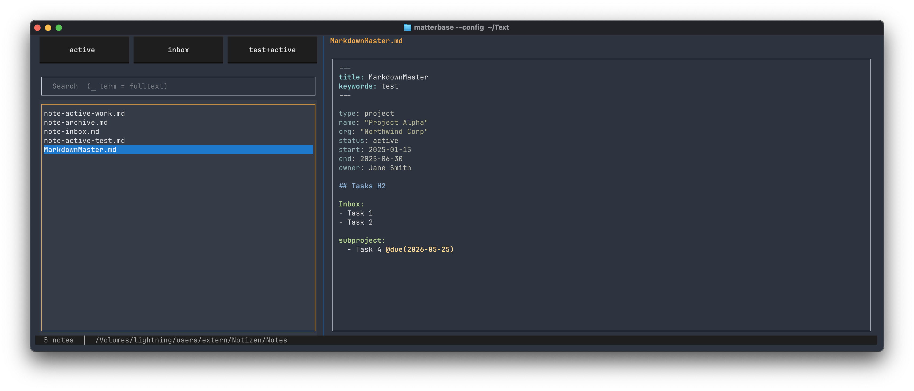
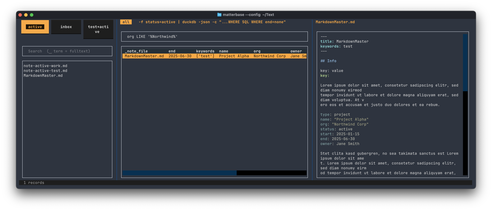

# matterbase

A database-like TUI for querying frontmatter and YAML in Markdown notes with field filters, full-text search, and table view. grubber and matterbase are designed to keep data and context together.

Built with [Textual](https://github.com/Textualize/textual). Uses [grubber](https://github.com/rhsev/grubber) for frontmatter-based filtering, [apex](https://github.com/ttscoff/apex) for preview rendering, and [nushell](https://www.nushell.sh) for table queries. For macOS and Linux.


*Note list with compact preview (`m`) showing only frontmatter and YAML blocks.*


*Note list with metadata table (`t`). All data fields from frontmatter and YAML at a glance.*

## Requirements

- Python 3.10+
- [grubber](https://github.com/rhsev/grubber) — bundled binary included for macOS arm64; for other platforms install grubber separately and make sure it's on `PATH`
- [apex](https://github.com/ttscoff/apex) (optional, for preview)
- [nushell](https://www.nushell.sh) (optional, for table queries)

## Installation

```
pipx install git+https://github.com/rhsev/matterbase
```

Updates:

```
pipx upgrade matterbase
```

## Usage

```
matterbase --config path/to/config.yml
```

## Config

```yaml
notes_dir: ~/Notes/Work        # flat directory of .md files
editor: hx                     # editor command
apex_theme: ralf               # apex theme name (optional)
apex_width: 80                 # apex --width value (optional)
apex_code_highlight: pygments  # apex --code-highlight tool: pygments or skylighting (optional)
compact_tasks_heading: Tasks   # h2 heading shown in compact preview (default: Tasks)
multi_select: true             # multiple active filters → AND-intersect
grubber_search_mode: all       # all | frontmatter | blocks_only  (default: all)
array_fields: [tags, keywords] # fields grubber normalises to arrays
table_columns: [status, project, type]          # columns shown in table view (omit = all)
table_query: "where status != 'archive'"        # default nushell query for table (optional)

filters:
  - label: "active"
    query:
      - "status=active"

  - label: "business"
    query:
      - "project=business"
      - "status=active"       # AND within one button

  - label: "Q1-2025"
    query:
      - "start^2025-01"
```

### Filter operators (grubber syntax)

| Operator | Meaning      | Example          |
|----------|--------------|------------------|
| `=`      | equals       | `status=active`  |
| `~`      | contains     | `name~hosting`   |
| `^`      | starts with  | `end^2025`       |
| `!`      | not equals   | `status!archive` |

Multiple expressions within one button are ANDed together. With `multi_select: true`, activating multiple buttons ANDs the result sets.

## Keybindings

| Key              | Action                               |
|------------------|--------------------------------------|
| `Tab`            | Cycle focus: buttons → search → list → query |
| `↑` / `↓`       | Navigate list                        |
| `Enter`          | Open selected note in editor         |
| `Space`          | Toggle focused filter button         |
| `p`              | Toggle preview pane                  |
| `t`              | Toggle metadata table                |
| `m`              | Toggle compact preview (frontmatter + YAML blocks + Tasks) |
| `ctrl+r`         | Run nushell query                    |
| `y`              | Copy current grubber command to clipboard |
| `Y`              | Copy current grubber command to clipboard and quit |
| `Escape` / `q`   | Quit                                 |

## Search

Type in the search field to filter by filename. Prefix with a space to search full text (filename + content).

```
meeting          →  filename contains "meeting"
 budget          →  filename or content contains "budget"
```

Fulltext search behaviour:

- Starts after **3 characters** (shorter terms match too broadly)
- Stops collecting results after **25 matches** — refine the term if you see "25+ Treffer"
- Debounced by **200 ms**: the search fires only after you pause typing

## Metadata table (`t`)

Press `t` to switch the right pane from preview to a metadata table. The table shows frontmatter fields for all currently visible notes.

A nushell query field appears below the file list. Type any nushell pipeline fragment and press `ctrl+r` to filter the table. nushell does not need to be running — matterbase calls it in the background:

```
where status == "active"
where start > "2025-01-01"
where status == "active" | select file status project
sort-by start --reverse
sort-by { $in._note_file | path basename }
```

The file column in the table shows only the filename, but in nushell queries the full path is available as `_note_file`. Use `path basename` to sort by filename.

The table cursor follows the file list selection. Press `t` again to return to preview mode.

## Compact preview (`m`)

Press `m` to toggle compact preview mode. Instead of the full note, apex renders a condensed view containing:

1. **Frontmatter** — the complete YAML front matter block
2. **YAML code blocks** — every ` ```yaml ` block in the document, with its immediately preceding heading (if any)
3. **Tasks section** — the first `## Tasks` h2 section (heading configurable via `compact_tasks_heading`)

Compact mode is useful for quickly scanning note metadata and task lists without scrolling through full content.

## Yank (`y` / `Y`)

Press `y` to copy the current grubber command (with active filters and optional nushell query) to the clipboard. `Y` does the same and then quits, printing the command to stdout — useful for piping matterbase into other tools.

Clipboard support is cross-platform: `pbcopy` on macOS, `wl-copy` on Wayland, `xclip` or `xsel` on X11.

## Architecture

The design decisions behind this are explained in [ARCHITECTURE.md](ARCHITECTURE.md).

## nushell query reference

Common queries and known limitations: [NU-QUERIES.md](NU-QUERIES.md).
